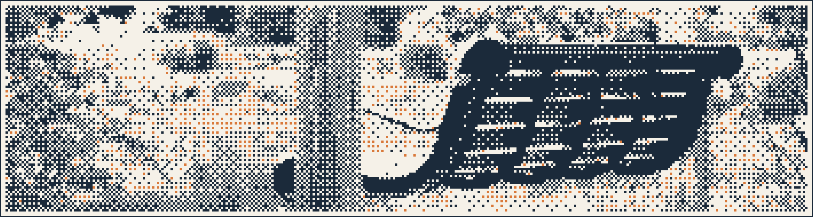

<!-- 340px wide, ordered dither, 68 frames. github.com/iatosh/ditherpress -->

### Hi, I'm Satoshi 👋

- 🧠 **Research:** machine learning for biosignals, especially electroencephalogram
- 🏫 **Lab:** Tanaka Lab, Tokyo University of Agriculture and Technology
- 🛠 **Daily drivers:** Neovim, WezTerm, AeroSpace, herdr
- 🎤 **Elsewhere:** a cappella and beatbox
- 🌏 **Languages:** 日本語 / English / 中文

